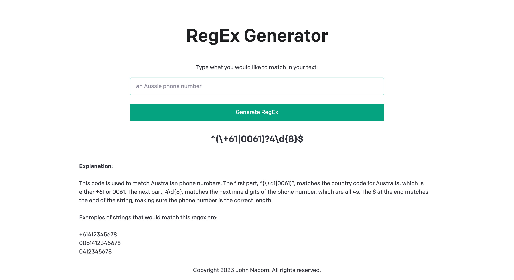

# RegEx Generator

Using OpenAi to create a React and Nextjs app that generates RegEx expressions based off a natural language description of what you would like to match.

To run:
1. clone repo
2. npm install
3. create .env file and add API key
4. npm run dev

Deployed on Vercel, however I get a 401 unauthorised error whenever my API tries and makes a request: https://regex-generator-teal.vercel.app/

Function log of the /api/generate error generated from Vercel:
  response: {
    status: 401,
    statusText: 'Unauthorized',
    headers: {
      date: 'Tue, 03 Jan 2023 06:04:46 GMT',
      'content-type': 'application/json; charset=utf-8',
      'content-length': '238',
      connection: 'close',
      vary: 'Origin',
      'x-request-id': '48876351e85679cd9581feb7364a0b97',
      'strict-transport-security': 'max-age=15724800; includeSubDomains'

